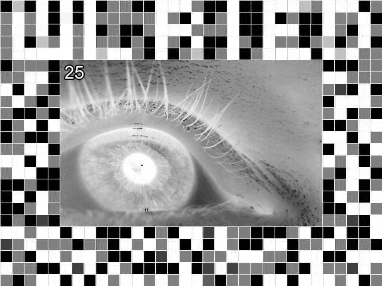
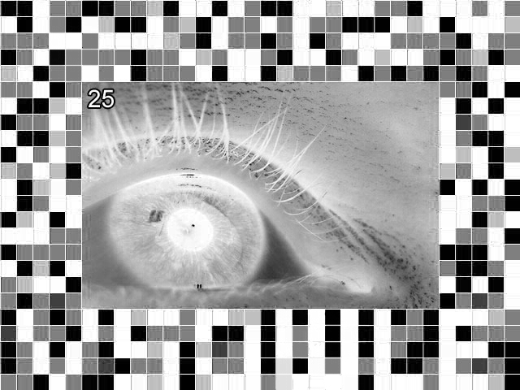

<!-- markdownlint-disable MD013 MD033 -->
# Levels 11-20

## [Level 21 - the fake trapped him](https://notpron.com/notpron/twentyone/again.htm)

The only notable thing is the name of the image is `white.jpg` and looking at the content seems obvious what to do next, change it to different colors.

Aside from `white.jpg` every other image seems to resemble some kind of maze and I think it needs to be put together, another reason why I'm confident in it being a maze is this comment in the source `<!--First to beat it: [zeend_22] stupid maze :P-->` that I would assume its not a red herring.

We also have the hint when opening the form via clicking the alpha symbol (α) 'From A to O', I don't think this is literal, it probably means 'From alpha to omega' instead (also because there is no O), and since there are two omegas then I think both paths will give the credentials.

Considering all of this we have the following maze:

I'm not sure if the aligning with the alpha and omegas is right though, since no matter what I tried no position seemed to align every element at once and maybe is naive but I would assume the starting point is the black square since every image has it, and there is also another trap with this image since some colors are hiding some others.

This is a problem since I think the colored words naming colors may mean the allowed transitions, like with the first one allowing blue-red transitions in this maze and also implies the only black transition allowed is with orange and an unnamed color, but with this recreation I wouldn't be able to move anywhere then.

I'm so incredible at this (I think for now), just thought that maybe by removing from the maze the colors which are not present coloring some word in the list, this in turn would remove light blue and lilac, giving the following:

And we can now get a word following the path towards omega 2, which is 'smarter'. But now for omega 1 there is no connection from the start.

Finally I realized that by just moving the alpha and omegas slightly higher I can get to omega 1, revealing the username with it:

Maybe the locations for alpha and the omegas were just approximated or seomething like that but I'm glad I did it anyways.

  
Click to reveal credentials

  - username: getting 
  - password: smarter

## [Level 22 - omg jeez!](https://notpron.com/notpron/beepbeep/banana.htm)

Again there is nothing much to see in the source and the title doesn't help that much, but the image file name (`screeeen22b.jpg`) seems awfully similar to that of [level 18](11-20.md#level-18---sorry-going-on-for-some-more-time), so let's try it again and hopefully this time it isn't some red herring.

Well it was, and again with explicit imagery, there was only two other images, `screeeen22a.jpg` said 'looking for pron again? ##, X = pron', I can't quite make what I wrote as #s, but I should've known it was just going to be the same, as you can imagine the other image was on `screeeen22x.jpg`.

I also tried changing the file name to `scren22b.jpg` and `screen22.jpg` but no luck either.

But the plot twist is that I did all of that for nothing because I solved it at a first glance, the original image itself says 'the answer is unexpected', so I just changed in the link the `.htm` to 'unexpected' and it worked.

## [Level 23 - I'm the tiniest unit you can see](https://notpron.com/notpron/beepbeep/unexpected.htm)

The only notable think from this level I think its the title, the image itself seems just like some sincere greetings, and although the image file name its labeled `screentwentythree.jpg`, I tried with `screen23.jpg` but no luck.

And since there is no form I guess I should just change the file name of the `.htm` in the url and using the title of the page I guess I should use tiny things.

After trying with some words like atoms and electrons I realized it said visible things, so I just searched in Google for some examples and pixel came out, using it I got to a [new page](https://notpron.com/notpron/beepbeep/pixel.htm) but without beating the level.

In this new page the title is 'huhu! I'm tiny!' and I it has another hint towards the solution 'ya, I'm small and red, zoom for me', so it should be something small and red, or maybe its just a description for a pixel but I don't think so, since commonly a pixel uses 3 colors.

After trying with some tiny red things like blood, bugs, grains, even stars since in the sky they appear small, I realized that maybe since we are talking about pixels and the hint says to me that I should zoom, it may be hidden in the seemingly inocent image, and after some basic editing with the brightness and contrast of the image I say a hidden message:

In the bottom says 'Temporary end check back soon!', I guess this is just something that got edited some time ago but never fully deleted, and at the top there seems to be some kind of message but for now its just gibberish.

Using a HSV channel separator online I got the following image:

In this image the bottom message is more clear, but the top message doesn't seem to have anything meaningful, I thought of braille but doesn't seem quite like it.

I tried just in case with 'ninschen' but the page told me 'stop looking for names, they have nothing to do with it' so I have that now.

But the other interesting thing in the image are the random letters being differentiated from other ones, but I tried joining them all and nothing good comes out.

After a lot of tinkering (including, but not limited to, creating a python script to emulate looking at the screen with a magnifying glass and used on both the original image and the last one I showed, using the bucket tool with 0 tolerance in the white background) I just noticed while zooming in the original image that are literally single red pixels in the image on specific letters, now joining them we get the word 'sound' so replacing it in the url we pass the level, I guess the 'beepbeep' in it could count as a hint aswell.

## [Level 24 - 0_o](https://notpron.com/notpron/beepbeep/sound.htm)

At least now we got an easy level, the only relevant thing is a comment in the source `<!--995674663-->` and considering the image I thought of a cellphone keypad but that only gave 'xjmpgnd', so clearly that wasn't the case.

Since there is a Google search bar I thought of just googling the number and got recommended a T9 converter (I didn't know this was a thing, rather than pressing a number multiple times per letter you do it once and it tries to find a word in a dictionary or something like that), translated it using that and got 'xylophone' which I replaced in the url.

## [Level 25 - FF0000](https://notpron.com/notpron/beepbeep/xylophone.htm)

The main hint I noticed aside from the title and the password hint its a comment at the end of the source `<!--multiply OR limit channels; note to self, tell people the same as in #13: no maths-->`, in particular the first part since it seems to indicate that we should split the color channels of the image and this is also connected to the title 'FF0000' since its the color red in hex which means we will limit this channel, and the same with '0000FF' which is blue. So doing that we got the following images:

So reading the letters we get 'wlried' and 'vsowle', at first I don't recognize this and trying with caesar ciphering doesn't help, so I used my next trick using anagrams, searching for an anagram solver online I got the following words for each:

- **wlried**: wilder / rewild
- **vsowle**: vowels / wolves

We have four possible combinations but one of them seems related so trying with it gets us the credentials, we open the form by clicking the eye.

  
Click to reveal credentials

  - username: wilder 
  - password: wolves

## [Level 26 - Number twenty six](https://notpron.com/notpron/screen26/)

This level seems one of the most simple ones, there is nothing that notable, I first tried changing `screen26` to `screen27` but only got this message 'no for fucks sake. i thought we got beyond these cheap attempts.......jeezus..........  -_-'.

There is a comment in the source `<!--The top left corner number NEVER lies, keep that in mind-->` but for now it doesn't seem that helpful.

After a while I tried to just access `zipper.htm` using the url `https://notpron.com/notpron/screen26/zipper.htm` and got the following text 'yes, its a zipper, try to zip it!', I guess this means I need to zip something

Finally after a little while I realized I should interpret it more literally than I was already doing, the name of the image is `screen26.jpg` so I should just try and access the file `screen26.zip`, with that I got the answer, which is the level 27 itself.

## [Level 27 - screen27.jpg](https://notpron.com/notpron/screen26/screen26.zip)

Unzipping the file we get an image (`screen27.jpg`) which is the level itself and a text file (`readme.txt`), the latter contains 'yes, its 27 in here. i hope it helps you to get from 26 to 28'.

I tried like a thousand words in the url bar for level 26 since I think is so unlikely I get a full link or another file from this two files, I already did some stego on both but they appear to have nothing else in them, also tried editing the image but no luck either so I guess its just that I need to change the url somehow to get to level 28.

After another thousand attempts I just thought that maybe, even though never before in the url the 'notpron' has changed, maybe this time it would, and since the people in the image are asking for boobs it seemed fitting to remove the 'not', and what do you know it worked (I tried adding `pron.htm` at the end of the url before but clearly I was almost there).

## [Level 28 - #28](https://notpron.com/pron/screen26/)

This level just has an image saying 'wrong number, ain't it?', and also in the source the comment `https://notpron.com/pron/screen26/`, I guess its just pointing out that in the path now we are not in level 26, so just change that to 29 (since we want to go there now).

## [Level 29 - #29](http://notpron.com/pron/screen29/)

Pretty similar to the previous one, now the message is 'good (yes, you are right here), but... we are still wrong in some way...', now since just changing it to 30 doesn't seem to work the next obvious guess its that we should return to notpron.

The image itself provides us with the credentials for the next level.

  
Click to reveal credentials

  - username: rockin 
  - password: boppin

## [Level 30 - Right in the creators face](https://notpron.com/notpron/screen30/)
