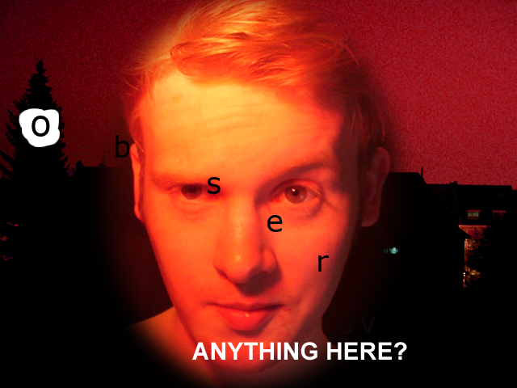

<!-- markdownlint-disable MD013 MD033 -->
# Levels 31-40

## [Level 31 - He forgot where he took it!](https://notpron.com/notpron/screen30/davidandhism2.htm)

Based on the title I guess we just need to put the location of the image in the url, my first thought was to see in the metadata of the photo.

First I tried with the province (Saarland) which is in there but got 'and where in saarland', so I guess it needs more precision, then scrolling down I got the city (Hirstein) and that was the answer.

## [Level 32 - Ain't it?](https://notpron.com/notpron/screen30/hirstein.htm)

In this level the main thing I noticed was the comment `<!--little difference somewhere!-->`, that got me thinking it may be that there is a small difference in the source code between the previous page.

Sure enough after discarding the obvious difference in titles and image name, there is a css style file with a different path than before, clicking to see its contents showed the answer in a comment inside.

## [Level 33 - Hit the any key](https://notpron.com/notpron/screen30/macroscopic.htm)

In this level the only extra hint directly available is a comment in the beginning of the source `<!--"Be quiet+Anakin"-->`, but at least right now I don't get it.

The title prompts us to hit the any key, and looking at the keyboard in the image its located where the Windows key would be (sorry for Mac users), using this in the url as `windows.htm` we get an additional hint 'type any instead of hitting the key'.

From that I guess we should try to type any in the keyboard of the image and map the keys to an actual qwerty distribution, in this case we get.

Well I tried but got nothing, instead I tried typing in the qwerty keyboard distribution and mapping to the one in the image 'stfu' which is what the guy in the comic says (sorry I don't know who he is from the saga).

- s -> k
- t -> e
- f -> w
- u -> l

Then putting in the url `kewl.htm` we get the message 'thats only the half', so I guess that's where the comment in the source comes in, in this case I assume its the 'Be quiet' part since I don't think he is Anakin, trying with the word 'any' again and this new mapping I get:

- a -> d
- n -> a
- y -> z

Trying with `kewldaz.htm` shows 'our keyboard is german, isn't it?', searching online I just realized the keyboard in the image is somewhat similar to the german distribution.

After a little experimentation I tried mapping 'kewldaz' again but with the german distribution which resulted in `kewlday.htm` which was the answer, I guess they were trying to say cool day but idk if that's supposed to be related with Star Wars or not, like May 4 or something but I don't see any connection.

## [Level 34 - He needed it to carry on](https://notpron.com/notpron/screen30/kewlday.htm)

The page itself doesn't offer too much aside from the hint that Google is needed it seems, after a little experimentation I assumed it has something to do with Shell plc because of the logo so being hinted by the title I got to `gas.htm` (after trying with `oil.htm`), the page said 'gas as in fuel?' so I tried `fuel.htm` and got two quotes 'Level 32: No, ignore this fuel.htm file and go back. It's not related to your level. Neither are you supposed to find out what is in the pic.' and 'Level 34: what kind of?', so let's just ignore the first one.

I don't know that much about fuels, I assume it has to do with the octanes because of the 82 in the image so I searched in Google for it and got 'Aviation Gasoline (Avgas 82UL)', I tried with some individual words related to it and for now just got a page from `unleaded.htm` saying 'unleaded what?'.

I tried some things but nothing so far except for `pb.htm`, since Pb is the chemical symbol of lead, but just got the message 'you are so smart', well thanks :).

Finally got it, it was just `unleadedfuel.htm`.

## [Level 35 - 28�23'46''N](https://notpron.com/notpron/screen30/unleadedfuel.htm)

I guess there is some kind of encoding problem with the title (and the hint 81� 34' 42''W), most likely the strange symbols are just the degree character (°), even in the console I get an error of character encoding.

In any case, it seems obvious that these are coordinates, plugging them in google maps shows 'Lake Mickey'.

And finally after a long while we get another form for credentials when clicking the image, the credentials are obviously from Mickey Mouse.

  
Click to reveal credentials

  - username: mickey 
  - password: mouse

## [Level 36 - Some are so limited](https://notpron.com/notpron/nomeaning/)

In this level what instantly stands out to me is the `<psd>` tag that wraps the image, that's not native, so my first thought was to open the image in Photopea assuming that it was a `.psd` file instead of a common image but not, then I tried downloading the file `36tbh.psd` from the page, since that's just the name of the image but with the extension changed, and what do you know it worked.

Opening the file in Photopea reveals the project being slightly different than the original image and with some layers.

This is the image with all layers shown (and I painted the white spot to be able to see the 'O'):

With that we can clearly see that the strange letters end up forming the word 'observe', put that in the url and got it.

## [Level 37 - 080135](https://notpron.com/notpron/nomeaning/observe.htm)
