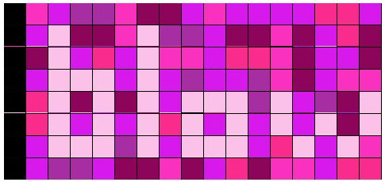
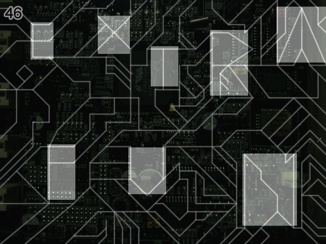

<!-- markdownlint-disable MD013 MD033 -->
# Levels 41-50

## [Level 41 - eep](https://notpron.com/notpron/nomeaning/next.htm)

In this level the major thing we noticed is the new audio and its file name which is `meep1.jpg`. It sounds just like music and inspecting it in Audacity doesn't seem to add anything worth noting.

For a moment I thought this level was gonna be awful, specially since searching in Google meep throwed some random software about simulating electrodynamics and made me think I would have to install it and try to somehow map the audio to some input into it, I discarded this ~~for my sanity~~ because it said that it didn't have native support on Windows and I doubted the creator would make some puzzle limited to some specific OS.

Then I realized that since the image file name has a 1 instead of the level number in it maybe changing it would get another file, and what do you know it worked with 2.

The audio `meep2.mp3` resembles morse code, good thing one of the few almost useless things I learned in my life was this, although I'm a bit slow when trying to decipher it rather than sending my own message but I got it and the audio revealed the word 'genius' and that's the answer.

## [Level 42 - Originally written by...](https://notpron.com/notpron/nomeaning/genius.htm)

From the title I assume we need to find the composer of this song, just if I had any change I tried with Beethoven and Mozart but both said 'stop randomly guessing composers!' so I guess it won't be any famous one.

THankfully this was somewhat easy to figure out, if I had to just search who wrote this specific piece I would've had a bad time, but there is some text in the bottom of the page '22 15 15 4 15 15' which is clearly A1Z26 cipher (or just map each number to a letter according to their position in the alphabet) and it says the word 'voodoo'.

From this we could assume that this piece was by Big Bad Voodoo Daddy, someone from earlier puzzles, so searching for its composer we get Scotty Morris and that's the answer (actually I first tried with `scotty.htm` and got 'he has a last name').

## [Level 43 - Time flows](https://notpron.com/notpron/nomeaning/scottymorris.htm)

The page is pretty bare, the image name being `43small.jpg` hinted me towards having other files with different sizes and that led me to `43big.jpg` and `43large.jpg` but they are identical to the photo except for their dimensions.

From the image the only strange thing I noticed was a singular red pixel in the frame of the clock to the right side but it doesn't seem to mean anything.

I tried using `clock.htm` and clearly got insulted with the message 'you are the most unoriginal, sorry being that I know', sorry for trying to at least get a hint I guess.

I also tried changing my pc hour to that of the photo and didn't work for both possibilities, the other option would be to wait for that hour to come naturally but I would have to guess the time zone of the server so I don't think that's it.

Obviously I already tried putting the hour in the url bar in all forms that I could thing of but none have worked so far.

Now I tried with different times of the day until `night.htm` somehow worked with the following message 'no no no', I'm not really quite sure in what sense this no is applying like, I'm not supposed to be thinking of these stages? night is wrong? regardless one more hint towards the solution.

After a bit of thinkering I noticed there is like a stain in the clock that seems unnatural but I can't quite make what it is, so I used the bigger versions of the photo and it was the answer.

## [Level 44 - On a stick...](https://notpron.com/notpron/nomeaning/verysmall.htm)

These kind of images make me feel like the only solution is to just make something crazy with the image so I won't bother trying anything else, also after some attempts I got to the image `boy.jpg` but basically it said that I just needed to play around with the `girls.jpg` image (the original in this level).

I gotta admit, this level also made me lookup the Notpron forums since it seemed pretty hard, the only things I tried before this were trying to color white the cells that were closest in color the pink used for the 44 in the top left but no luck, and also tried like counting from the left the number of cells to get to each black one since there was only one of these per row and using A1Z26 ciphering but nothing again.

After some hints from the forums saying lining up something and the stick I got to lining from the image the black squares into a vertical line, moving alongside all tiles in their row (the rubik's cube hints in the forums don't fit with this type of movement for me but I guess other kind of description would give away too much), showing the solution from it:

## [Level 45 - quarante-deux](https://notpron.com/notpron/nomeaning/blow.htm)

In this level the main thing is that there are words for numbers in different languages, ranging from 40 to 45, in this case the order is:

- quarenta -> portuguese
- cuarenta y uno -> spanish
- quarante-deux -> french
- drieënveertig -> dutch
- vierundvierzig -> german
- femogfyrre -> danish

After a while I realized that this order was suggesting a route in the real world, each one of these languages is mainly associated with one country, so in a map this route of adjacent countries is as follows: portugal -> spain -> france -> belgium -> germany -> denmark.

So following this path we come across two possible countries, Norway and Sweden, but the correct one is Sweden, so finally we translate 46 to swedish and get the answer.

## [Level 46 - For the meantime...](https://notpron.com/notpron/nomeaning/fyrtiosex.htm)

This was an easy one, from the image name we can see that its the format 'I have a random letter at the end', so try and change to different letters of the alphabet and the only other image that exists is `46b.jpg`, we can edit this two images together and get a highlight of zones which in turn can be interpreted as letters, here is the result:

  
Click to reveal credentials

  - username: extra 
  - password: fun

## [Level 47 - ? o_o dbm o_o Ab7 o_o dbm](https://notpron.com/notpron/threethreethree/)

From this level the audio is new, I thought of trying to edit the image name but didn't seem to work so I just stuck with the audio.

The main reason I stuck with it was that I noticed that reversing it resulted in piano chords, now I'm not a musician so I don't know which one is it so I just tried them all.

First I tried with `dbm.htm` and actually I got the text 'not at all', with this I thought I had to be close, so I kept on trying until I got to `cdim.htm`, which actually showed the message 'gbdim.htm', I guessed this was the answer and it was right.

PS: This level was awful, in here I made it seem like a quick process but in reality it took me hours.

## [Level 48 - AGCGCGATTAACACCAGCGAAGTGGAA](https://notpron.com/notpron/threethreethree/gbdim.htm)

I think this was the fastest I've done so far (excluding first levels).

Considering the DNA in the image and the title I just put the text into a codons translator (DNA codons to amino acids, keeping just the first letter of the latter) and it gave the answer directly.

## [Level 49 - 49](https://notpron.com/notpron/threethreethree/saintseve.php)

From this level my first thought after reading the password hint was the movie Fahrenheit 9/11, this alongside the comment `<!--USA vs GERMANY LBS vs KG INCH vs CM-->` made me think that maybe I had to use the presidents' names from those countries during 9/11, but it didn't work.

Then I thought that maybe the hint itself was the answer and I just had to transform it according to the comment in the source, considering dollar and fahrenheit are commonly used in the USA I immediately got to 'eurocelsius', since those are standard in Germany.

But the 911 got me stumbled until I just searched for it in Google and got recommended the emergency phone numbers in Germany, and that's when I realized that 911 is that in the US, so using instead 112 (the emergency number in Germany, 110 also works) I got the credentials.

To open the form just click the 49.

  
Click to reveal credentials

  - username: 112 
  - password: eurocelsius

## [Level 50 - shot!](https://notpron.com/notpron/flutsch/index.htm)
